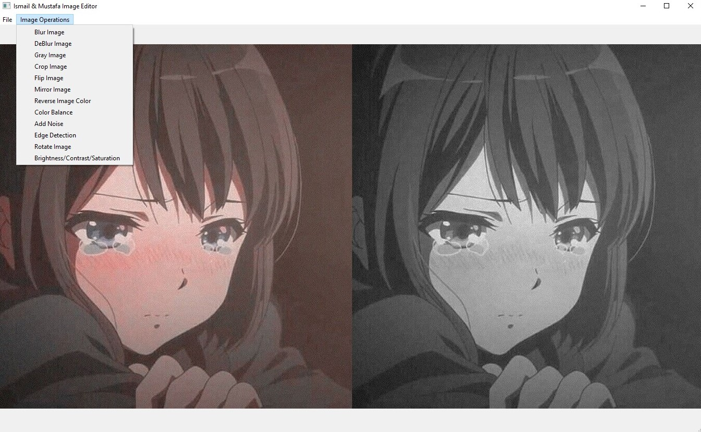

# Simple-Image-Processing-Tool-with-PyQt-and-OpenCV

In this project, we will put various image applications that we learned in the BBM413
Computer Image course into a real-time application. Within the scope of this project, we will
perform the following functions: upload and display image, save image, blur/unblur image,
grayscale image, crop image, flip image, mirror image, rotate image, invert image color,
change color balance, adjust image brightness, adjust image contrast, adjust image saturation,
add noise to the image, detect the edges of the image. In this project, we will make an image
application with a graphical user interface (GUI) with the Python language and Python
framework QT (desktop application making tool). Thus, a user can easily perform the
operations with the functions described above. In our application, all our functions work
without any problems. We also benefited from different libraries of Python such as OpenCV
for the project.
